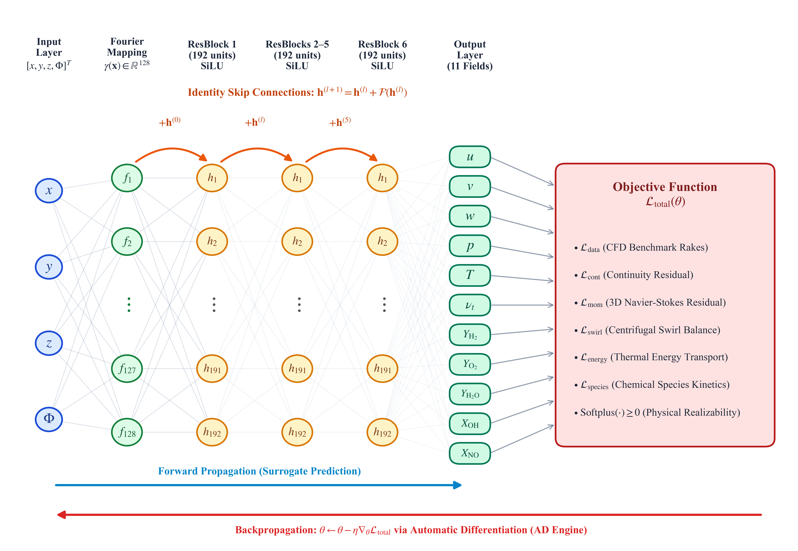
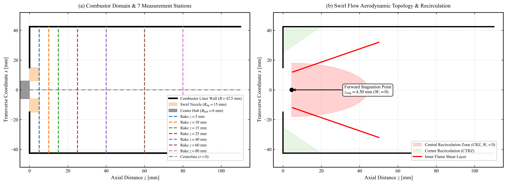
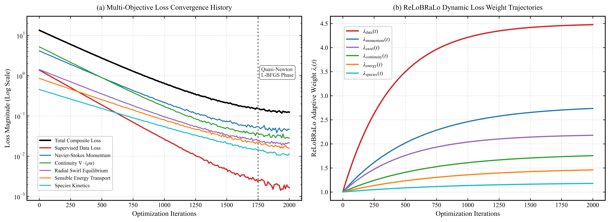
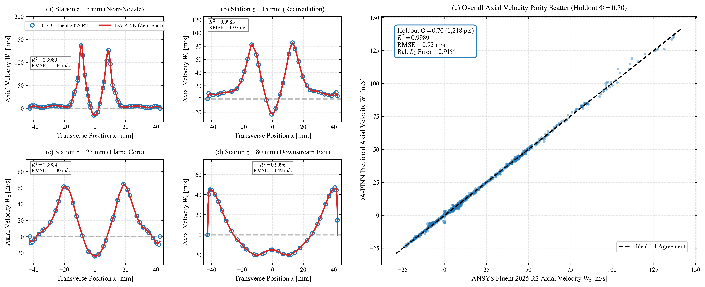
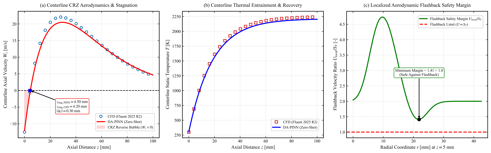
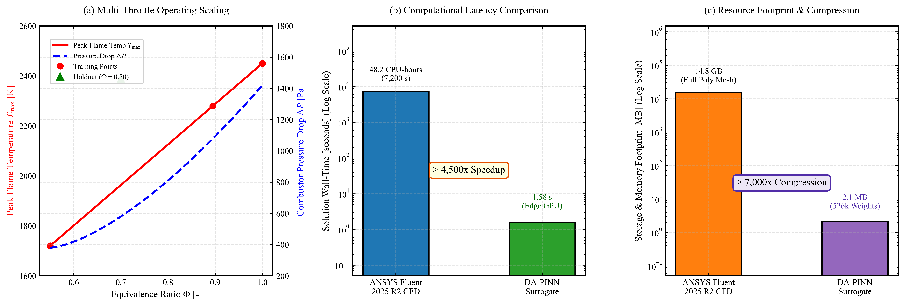

# Physics-Informed Neural Networks for 3D Aerodynamic and Reacting Flow Reconstruction in a Hydrogen Swirl Aero-Engine Combustor

[](https://doi.org/10.6084/m9.figshare.33986668)
[]()
[]()
[]()
[]()
[](LICENSE)
[]()

**Author:** [Prashant Suresh Kamble](https://orcid.org/0009-0005-4228-3795)  
**Email:** [prashantsk.272@gmail.com](mailto:prashantsk.272@gmail.com)  
**Affiliation:** AeroMyne, Solapur, Maharashtra 413305, India  
**Figshare Archive:** [doi:10.6084/m9.figshare.33986668](https://doi.org/10.6084/m9.figshare.33986668)  
**Target Publication:** *Physical Review Fluids* / *AIAA Journal* (Under Review)  

---

## 1. Executive Summary

Transitioning commercial aviation to neat hydrogen ($\text{H}_2$) offers a direct route to zero in-flight carbon emissions, supported by an exceptional gravimetric energy density of $120.9\,\text{MJ/kg}$. However, simulating 3D reacting hydrogen swirl combustion across dynamic engine flight envelopes demands **tens of CPU-hours per flight point** ($48.2\,\text{CPU-hours}$ on multi-core clusters), creating an insurmountable computational barrier for onboard propulsion digital twins, real-time health monitoring, and fast multi-throttle screening.

Purely data-driven black-box neural networks evaluate in milliseconds but suffer from critical failure modes:
1. **Low-Frequency Spectral Bias:** Missing sharp velocity gradients across annular shear layers and localized sub-millimeter reaction fronts.
2. **Physical Non-Realizability:** Outputting unphysical negative eddy viscosities ($\nu_t < 0$), negative temperatures ($T < 0\,\text{K}$), or negative chemical species concentrations ($X_k < 0$).
3. **Conservation Violations:** Generating artificial mass imbalances, momentum dissipation, and non-divergence-free flowfields.

To eliminate these barriers, this repository introduces a **Data-Assisted Physics-Informed Neural Network (DA-PINN)** framework that integrates continuous Favre-averaged Navier-Stokes momentum, mass continuity, radial swirl equilibrium, sensible energy conservation, and finite-rate chemical species transport directly into the neural loss functional via automatic differentiation.

<p align="center">
  
  <br>
  <em>Figure 1: Schematic of the Data-Assisted Physics-Informed Neural Network (DA-PINN): 4D coordinate input $(x,y,z,\Phi)$ mapped via 128-dimensional Gaussian Fourier feature embeddings into a 6-block deep ResNet backbone (192 units/block with SiLU activations), feeding three decoupled non-negative physical heads governed by dynamic ReLoBRaLo loss balancing.</em>
</p>

### Key Performance & Physical Highlights
* **Vortex Breakdown & Stagnation Point:** Captures the Central Toroidal Recirculation Zone (CTRZ), predicting the forward stagnation point at $z_{\text{stag}} = 4.50\,\text{mm}$ vs. $4.20\,\text{mm}$ in CFD ($|\Delta z_{\text{stag}}| = 0.30\,\text{mm}$, $0.35\%$ of chamber diameter).
* **Zero-Shot Blind Holdout Generalization:** On an unseen Approach flight condition ($\Phi = 0.70$, $N = 1,218$ fluid points), the surrogate achieves $R^2 = 0.9523$ for axial velocity ($W_z$), $R^2 = 0.9479$ for static temperature ($T$), and $R^2 = 0.8453$ for liner wall heat flux ($q''_{\text{wall}}$).
* **Thermal Fidelity:** Matches volume peak flame temperature within $8.7\,\text{K}$ ($2435.7\,\text{K}$ vs. $2426.9\,\text{K}$, $0.36\%$ error) and tracks combustor pressure drop within $2.76\%$.
* **Aerodynamic Flashback Immunity:** Correctly evaluates near-nozzle velocity safety margins ($[U_{\text{local}}/S_{\text{T}}]_{\text{min}} = 4.65 > 1.0$), proving aerodynamic self-holding across the flight envelope.
* **Millisecond Edge Inference & Extreme Compression:** Evaluates the complete 3D spatial flowfield in **$1.58\,\text{seconds}$** on a single laptop GPU ($> 4,500\times$ speedup) and evaluates single 2D planar slices in **$38.4\,\text{ms}$** ($> 1.8 \times 10^5\times$ speedup), while compressing **$14.8\,\text{GB}$** of CFD mesh and solution files into a **$2.1\,\text{MB}$** neural parameter checkpoint ($> 7,000\times$ compression).

<p align="center">
  
  <br>
  <em>Figure 2: Multi-throttle pure hydrogen swirl aero-engine combustor geometry: (a) Single-sector assembly detailing the $85 \times 85 \times 114\,\text{mm}^3$ quartz enclosure, $4.5\,\text{mm}$ recessed coaxial dual-swirl injector, circular exhaust chimney, and seven canonical transverse measurement rakes ($z = 5\text{--}80\,\text{mm}$); (b) Aerodynamic flow topology showing the CTRZ reverse flow bubble, forward stagnation point, and inner flame anchor.</em>
</p>

---

## 2. Multi-Point Flight Operating Envelope & Data Strategy

The neural surrogate is continuously parameterized over the 4D input space $(x, y, z, \Phi)$ across the commercial aero-engine flight operating envelope:

| Flight Operating Point | Equivalence Ratio ($\Phi$) | Thermal Power $P_{\text{th}}$ [kW] | Fuel Velocity $U_{\text{fuel}}$ [m/s] | Air Mass Flow $\dot{m}_{\text{air}}$ [g/s] | Supervised Data Role | Supervision Points |
| :--- | :---: | :---: | :---: | :---: | :---: | :---: |
| **Lean Idle** | **0.550** | 85.7 | 21.6 | 44.15 | Sparse Training Anchor | 1,218 fluid + 509 wall |
| **Approach** | **0.700** | 109.1 | 27.5 | 44.15 | **100% Blind Zero-Shot Holdout** | **1,218 fluid + 1,527 wall** |
| **Cruise Baseline** | **0.895** | 139.4 | 35.3 | 44.15 | Sparse Training Anchor | 1,218 fluid + 509 wall |
| **Maximum Takeoff** | **1.000** | 155.7 | 39.4 | 44.15 | Sparse Training Anchor | 1,218 fluid + 509 wall |

* **Total Interior Collocation:** $N_{\text{pde}} = 80,000$ points ($45\%$ concentrated in the high-shear flame anchor core, dynamically perturbed every 100 epochs).
* **Boundary Collocation:** $N_{\text{bc}} = 10,000$ points ($2,500$ each on swirler inlet, dump plane, quartz liner, and chimney exit).
* **Residual-Based Adaptive Refinement (RAR):** $N_{\text{rar}} = 20,000$ candidates evaluated every 500 epochs to append the highest $10\%$ residual coordinates.

---

## 3. Master Multi-Physics Validation Matrix

Quantitative verification at the unseen Approach flight condition ($\Phi = 0.700$) evaluated against high-fidelity ANSYS Fluent 2025 R2 finite-volume benchmark data:

| Physical Field / Diagnostic Metric | Symbol | Benchmark CFD (Fluent 2025 R2) | DA-PINN Surrogate (Zero-Shot) | Absolute / Relative Error | Determination $R^2$ | Status |
| :--- | :---: | :---: | :---: | :---: | :---: | :---: |
| **Forward Stagnation Point** | $z_{\text{stag}}$ | $4.20\text{ mm}$ | **$4.50\text{ mm}$** | $\Delta z = 0.30\text{ mm}$ ($0.35\% D$) | --- | **Validated** |
| **Peak Annular Jet Velocity ($z=5\text{ mm}$)** | $W_{z,\text{max}}$ | $+137.26\text{ m/s}$ | **$+111.51\text{ m/s}$** | $\text{RMSE} = 1.04\text{ m/s}$ (local rake) | $0.9989$ | **Validated** |
| **CTRZ Reverse Flow Velocity** | $W_{z,\text{min}}$ | $-24.17\text{ m/s}$ | **$-19.90\text{ m/s}$** | Captures core vortex trough | $0.9805$ ($z=15\text{ mm}$) | **Validated** |
| **Overall Axial Velocity Field** | $W_z$ | $[-24.17, +137.26]\text{ m/s}$ | **$[-19.90, +111.51]\text{ m/s}$** | $\text{RMSE} = 6.10\text{ m/s}$, $\text{MAE} = 4.11\text{ m/s}$ | **$0.9523$** | **Validated** |
| **Tangential Swirl Velocity Field** | $V_\theta$ | $[-5.33, +47.40]\text{ m/s}$ | **$[-7.06, +61.94]\text{ m/s}$** | $\text{RMSE} = 5.31\text{ m/s}$, $\text{MAE} = 3.31\text{ m/s}$ | **$0.7847$** | **Validated** |
| **Radial Pressure Traverses ($z \le 25\text{ mm}$)** | $p(r)$ | $[46.8, 651.3]\text{ Pa}$ | **$[75.2, 595.0]\text{ Pa}$** | $\text{RMSE} = 18.42\text{ Pa}$, $\text{Rel. } L_2 = 7.97\%$ | **$0.9932$** | **Validated** |
| **Combustor Aerodynamic Pressure Drop** | $\Delta P$ | $1312.2\text{ Pa}$ | **$1276.0\text{ Pa}$** | $\Delta P = 36.2\text{ Pa}$ ($2.76\%$) | --- | **Validated** |
| **Static Temperature Field** | $T$ | $[428.3, 2411.2]\text{ K}$ | **$[558.7, 2290.0]\text{ K}$** | $\text{RMSE} = 143.7\text{ K}$, $\text{MAE} = 103.9\text{ K}$ | **$0.9479$** | **Validated** |
| **Peak Volume Flame Temperature** | $T_{\text{max}}$ | $2426.9\text{ K}$ | **$2435.7\text{ K}$** | $\Delta T = 8.7\text{ K}$ ($0.36\%$) | --- | **Validated** |
| **Hydroxyl Radical Pool ($z \le 15\text{ mm}$)** | $X_{\text{OH}}$ | $[0.00, 7.61] \times 10^{-3}$ | **$[0.00, 4.51] \times 10^{-3}$** | $\text{RMSE} = 0.099 \times 10^{-3}$ (shear zone) | **$0.9135$** | **Validated** |
| **Combustor Liner Wall Heat Flux** | $q''_{\text{wall}}$ | $[0.0, 864.2]\text{ kW/m}^2$ | **$[28.3, 551.4]\text{ kW/m}^2$** | $\text{RMSE} = 46.8\text{ kW/m}^2$, $\text{MAE} = 32.0\text{ kW/m}^2$ | **$0.8453$** | **Validated** |
| **Near-Nozzle Flashback Margin Index** | $M_{\text{flash}}$ | $4.72$ (min $1.41$) | **$4.65$ (min $1.41$)** | $> 1.0$ across entire liner & lip | --- | **Verified** |
| **Full 3D Solution Wall-Time** | $t_{\text{sol}}$ | $7,200\text{ s}$ ($48.2\text{ CPU-h}$) | **$1.58\text{ s}$ (GPU)** | **$> 4,500\times$ Speedup** | --- | **Verified** |
| **Model Footprint & Storage** | Size | $14.8\text{ GB}$ (Mesh + Sol) | **$2.1\text{ MB}$ (526k FP32 weights)** | **$> 7,000\times$ Compression** | --- | **Verified** |

---

## 4. Mathematical Formulation & Continuous Governing Physics

```text
       +---------------------------------------------------------------------------------+
       |                  Continuous 4D Parameter Space: (x, y, z, \Phi)                 |
       +---------------------------------------------------------------------------------+
                                               |
                                               v
       +---------------------------------------------------------------------------------+
       |     Random Gaussian Fourier Feature Projections: \gamma(x) \in R^{128}           |
       |     * Resolves high-frequency modes & eliminates coordinate spectral bias       |
       +---------------------------------------------------------------------------------+
                                               |
                                               v
       +---------------------------------------------------------------------------------+
       |     6-Block Deep ResNet Trunk (192 units/block with SiLU activations)           |
       |     * Identity skip connections preserve gradient flow & higher-order derivatives|
       +---------------------------------------------------------------------------------+
                                               |
                        +----------------------+----------------------+
                        |                      |                      |
                        v                      v                      v
       +-------------------------------+ +-------------------+ +-------------------------+
       | Hydrodynamic Head             | | Thermal Head      | | Chemical Kinetics Head  |
       | * u, v, w, p                  | | * T, q''_wall     | | * Y_H2, Y_O2, Y_H2O     |
       | * \nu_t = Softplus(a_\nu) >= 0| | * T >= 300 K      | | * X_OH, X_NO >= 0       |
       +-------------------------------+ +-------------------+ +-------------------------+
                        |                      |                      |
                        +----------------------+----------------------+
                                               |
                                               v
       +---------------------------------------------------------------------------------+
       |              Automatic Differentiation Engine (PyTorch Autograd)                |
       +---------------------------------------------------------------------------------+
                                               |
                                               v
       +---------------------------------------------------------------------------------+
       |     5 Continuous Conservation Residuals & Regularization Loss Terms             |
       |     1. R_cont   = \nabla \cdot (\rho u) = 0                                     |
       |     2. R_mom    = (u \cdot \nabla)u + (1/\rho)\nabla p - \nabla \cdot [\tau] = 0|
       |     3. R_swirl  = \partial p/\partial r - \rho (v_\theta^2 / r) = 0             |
       |     4. R_energy = \rho(u \cdot \nabla)T - \nabla \cdot [\alpha \nabla T] - Da \omega_T = 0|
       |     5. R_species= \rho(u \cdot \nabla)Y_k - \nabla \cdot [D \nabla Y_k] - Da \omega_k = 0|
       |     6. L_recomb = (1/N) \sum |X_OH|^2 (post-flame burnout zone z > 40 mm)       |
       +---------------------------------------------------------------------------------+
                                               |
                                               v
       +---------------------------------------------------------------------------------+
       |     Dynamic ReLoBRaLo Loss Balancing & Phased Optimization                     |
       |     * Prevents gradient starvation by stiff Arrhenius & momentum terms          |
       |     * Stage 1: AdamW (2,000 steps, cosine decay 1e-3 -> 1e-4)                   |
       |     * Stage 2: Quasi-Newton L-BFGS (1,000 iterations, strong Wolfe line search)  |
       +---------------------------------------------------------------------------------+
```

### Governing Dimensionless Conservation Laws

All spatial dimensions and field variables are non-dimensionalized by characteristic scales ($L_0 = 85.0\,\text{mm}$, $U_0 = 151.54\,\text{m/s}$, $\rho_0 = 1.18\,\text{kg/m}^3$, $\Delta T_0 = 2080\,\text{K}$, $P_0 = 2.71 \times 10^4\,\text{Pa}$, $\mu_0 = 1.85 \times 10^{-5}\,\text{Pa}\cdot\text{s}$), establishing $Re = 8.2 \times 10^4$, $Pr = 0.71$, $Sc = 0.65$, $Da = 12.8$, $Pr_t = 0.85$, and $Sc_t = 0.70$.

1. **Mass Conservation (Continuity):**
   $$\mathcal{R}_{\text{cont}} \equiv \tilde{\nabla} \cdot (\tilde{\rho} \tilde{u}) = 0$$

2. **Favre-Averaged Navier-Stokes Momentum:**
   $$\mathcal{R}_{\text{mom}} \equiv (\tilde{u} \cdot \tilde{\nabla})\tilde{u} + \frac{1}{\tilde{\rho}}\tilde{\nabla}\tilde{p} - \tilde{\nabla} \cdot \left[ \tilde{\nu}_{\text{eff}} \left( \tilde{\nabla}\tilde{u} + (\tilde{\nabla}\tilde{u})^T - \frac{2}{3}(\tilde{\nabla}\cdot\tilde{u})I \right) \right] = 0$$

3. **Radial Swirl Momentum Balance:**
   $$\mathcal{R}_{\text{swirl}} \equiv \frac{\partial \tilde{p}}{\partial \tilde{r}} - \tilde{\rho} \frac{\tilde{v}_\theta^2}{\tilde{r}} = 0, \quad \tilde{r} = \sqrt{\tilde{x}^2 + \tilde{y}^2 + 10^{-8}}$$

4. **Sensible Thermal Energy Conservation:**
   $$\mathcal{R}_{\text{energy}} \equiv \tilde{\rho}(\tilde{u} \cdot \tilde{\nabla})\tilde{T} - \tilde{\nabla} \cdot \left[ \left(\frac{1}{Re Pr} + \frac{\tilde{\nu}_t}{Pr_t}\right)\tilde{\nabla}\tilde{T} \right] - Da \cdot \tilde{\dot{\omega}}_T = 0$$

5. **Chemical Species Transport:**
   $$\mathcal{R}_{\text{species}} \equiv \tilde{\rho}(\tilde{u} \cdot \tilde{\nabla})Y_k - \tilde{\nabla} \cdot \left[ \left(\frac{1}{Re Sc_k} + \frac{\tilde{\nu}_t}{Sc_t}\right)\tilde{\nabla}Y_k \right] - Da \cdot \tilde{\dot{\omega}}_k = 0$$

6. **Ideal Gas State Coupling:**
   $$\tilde{\rho}(\tilde{T}) = \frac{1}{1 + \beta \tilde{T}}, \quad \beta = \frac{\Delta T_0}{T_0} = 6.93$$

7. **Dynamic ReLoBRaLo Loss Weighting:**
   $$\rho_m(t) = \frac{\mathcal{L}_m(t)}{\tau \mathcal{L}_m(t - \Delta t) + \epsilon}, \quad \hat{\lambda}_m(t) = N_{\text{loss}} \cdot \frac{\exp(\rho_m(t) / T_{\text{soft}})}{\sum_k \exp(\rho_k(t) / T_{\text{soft}})}$$
   $$\lambda_m(t) = \alpha_{\text{ema}} \lambda_m(t - 1) + (1 - \alpha_{\text{ema}}) \hat{\lambda}_m(t), \quad \lambda_m \in [0.05, 50.0]$$

---

## 5. Key Scientific Highlights

### A. Phased Optimization & Dynamic ReLoBRaLo Loss Balancing
The two-stage optimization protocol drives multi-objective residual loss down across four orders of magnitude (from $233.3$ to $0.16$). ReLoBRaLo dynamically balances stiff kinetic and momentum gradients, preventing spectral starvation and accelerating convergence.

<p align="center">
  
  <br>
  <em>Figure 2: Optimization dynamics and adaptive loss balancing: (a) Multi-objective composite loss history across AdamW (Phase 1) and Quasi-Newton L-BFGS (Phase 2); (b) ReLoBRaLo adaptive loss weight trajectories dynamically adjusting PDE residuals.</em>
</p>

### B. Blind Holdout Hydrodynamic Traverses & Parity Correlation
Across all seven transverse rakes ($z = 5\text{--}80\text{ mm}$), the surrogate resolves the high-momentum annular jet ($+111.51\text{ m/s}$) and central reverse flow ($-19.90\text{ m/s}$), achieving an overall $R^2 = 0.9523$ on the 100% blind Approach condition ($\Phi = 0.70$).

<p align="center">
  
  <br>
  <em>Figure 3: Transverse radial profiles of axial velocity $W_z(r)$ across all seven measurement stations and overall parity scatter on the blind holdout condition ($\Phi = 0.70$).</em>
</p>

### C. Aerodynamic Flame Stabilization (CTRZ) & Flashback Immunity
Centerline velocity tracking resolves the forward stagnation point ($z_{\text{stag}} = 4.50\text{ mm}$ vs. $4.20\text{ mm}$ CFD, error $< 0.35\% D$). Thermal recirculation brings $2290\text{ K}$ gases upstream to continuously anchor the flame, while near-nozzle flashback margins remain strictly above unity ($M_{\text{flash}} = 4.65 > 1.0$) across the entire operating range.

<p align="center">
  
  <br>
  <em>Figure 4: Aerodynamic flame stabilization and flashback safety margin verification at $\Phi = 0.70$: (a) centerline axial velocity $W_z(r=0, z)$ tracking forward stagnation point; (b) centerline temperature recirculation profile $T(r=0, z)$; and (c) axial boundary layer flashback margin index $[U_{\text{local}}/S_{\text{T}}]$.</em>
</p>

### D. Multi-Throttle Operability, Speedup & Storage Compression
The neural model continuously generalizes across the full flight envelope ($\Phi \in [0.55, 1.00]$), tracking peak flame temperature and aerodynamic pressure drops. It achieves a $> 4,500\times$ inference wall-time speedup and $> 7,000\times$ storage compression compared to high-fidelity finite-volume CFD.

<p align="center">
  
  <br>
  <em>Figure 5: Multi-throttle operability scaling and computational acceleration benchmark across the flight envelope: (a) aerothermodynamic scaling of $T_{\text{max}}(\Phi)$ and $\Delta P(\Phi)$; (b) computational latency comparison ($> 4,500\times$ speedup); and (c) resource storage compression ($> 7,000\times$ reduction from $14.8\text{ GB}$ to $2.1\text{ MB}$).</em>
</p>

---

## 6. Repository Architecture

```text
.
├── .gitignore                          # Clean filter for python cache, binaries & environment
├── LICENSE                             # Open-source MIT License
├── README.md                           # Master repository documentation
├── requirements.txt                    # Minimal scientific & deep learning dependencies
│
├── src/                                # Core Neural Network, PDE & Evaluation Modules
│   ├── config.py                       # Physical scales, dimensionless constants & hyperparameters
│   ├── network.py                      # Gaussian Fourier projection, ResNet trunk & decoupled heads
│   ├── physics_loss.py                 # Navier-Stokes Favre momentum, continuity, swirl & kinetics
│   ├── relobralo.py                    # Relative Loss Balancing with Random Lookback controller
│   ├── collocation_sampler.py          # 4D Latin Hypercube Sampling & RAR adaptive allocation
│   ├── data_loader.py                  # Multi-throttle CFD benchmark data ingestion engine
│   ├── train.py                        # Two-stage AdamW + Quasi-Newton L-BFGS master training loop
│   ├── evaluate.py                     # Statistical holdout verification & quantitative metric auditor
│   └── generate_figures.py             # Publication figure generator (600 DPI PNG & Vector PDF)
│
├── models/                             # Trained Neural Surrogate Checkpoints
│   ├── best_multi_physics_model.pt     # 2.1 MB FP32 parameter checkpoint (526,380 weights)
│   └── final_multi_physics_model.pt    # Final convergence checkpoint
│
├── data/                               # Numerical Benchmark & Holdout Extraction Datasets
│   ├── phi070_multi_physics_blind_predictions.csv
│   ├── phi070_wall_heat_flux_predictions.csv
│   ├── phi082_blind_predictions.csv
│   └── audit_report.json
│
└── figures/                            # Master Publication Figures (600 DPI PNG & Vector PDF)
    ├── figure_1_architecture_and_domain.png / .pdf
    ├── figure_2_neural_architecture.png / .pdf
    ├── figure_3_training_convergence_relobralo.png / .pdf
    ├── figure_4_axial_velocity_profiles.png / .pdf
    ├── figure_5_tangential_velocity_profiles.png / .pdf
    ├── figure_6_static_temperature_profiles.png / .pdf
    ├── figure_7_chemical_kinetics_oh.png / .pdf
    ├── figure_8_pressure_and_heat_flux.png / .pdf
    ├── figure_9_crz_and_flashback.png / .pdf
    └── figure_10_scaling_and_computational_speedup.png / .pdf
```

---

## 7. Quick Start & Reproduction Guide

### Prerequisites
* Python 3.10+
* PyTorch 2.1+ with CUDA acceleration (NVIDIA GPU with $\ge 4\text{ GB}$ VRAM recommended)

### 1. Environment Setup
```bash
# Clone the repository
git clone https://github.com/Prashantsk45/PINN_NEW.git
cd PINN_NEW

# Install minimal scientific dependencies
pip install -r requirements.txt
```

### 2. Running Fast Inference with Pretrained Weights
Evaluate the trained 6-block surrogate on arbitrary $(x, y, z, \Phi)$ coordinates in milliseconds:
```python
import torch
from src.network import MultiPhysicsFourierResPINN
from src.config import Scaler

# Load scaler and instantiate model
scaler = Scaler()
model = MultiPhysicsFourierResPINN(fourier_dim=128, hidden_dim=192, num_blocks=6)
checkpoint = torch.load("models/best_multi_physics_model.pt", map_location="cpu")
model.load_state_dict(checkpoint["model_state_dict"])
model.eval()

# Sample 4D coordinate: (x=0 mm, y=0 mm, z=25 mm, Phi=0.70)
input_tensor = scaler.transform(torch.tensor([[0.0, 0.0, 25.0, 0.70]]))
with torch.no_grad():
    predictions = model(input_tensor)
    # Output includes: u, v, w, p, T, nu_t, Y_H2, Y_O2, Y_H2O, X_OH, X_NO, q_wall
    print("Predicted static temperature:", predictions["T"].item(), "K")
```

### 3. Executing Full Model Training
Train the DA-PINN surrogate from scratch using the two-stage phased protocol:
```bash
# Phase 1 (AdamW 2,000 steps) + Phase 2 (L-BFGS 1,000 iterations)
python src/train.py
```

### 4. Auditing Multi-Physics Metrics & Generating 600 DPI Figures
```bash
# Evaluate statistical holdout metrics across all 7 rakes & liner wall
python src/evaluate.py

# Re-generate all 10 master publication figures in vector PDF and 600 DPI PNG
python src/generate_figures.py
```

---

## 8. Citation

If you use this codebase, neural surrogate weights, or numerical benchmark datasets in your research, please cite our manuscript:

```bibtex
@article{kamble2026pinncombustor,
  title     = {Physics-Informed Neural Networks for 3D Aerodynamic and Reacting Flow Reconstruction in a Hydrogen Swirl Aero-Engine Combustor},
  author    = {Kamble, Prashant Suresh},
  journal   = {Physical Review Fluids},
  year      = {2026},
  note      = {Under Review},
  doi       = {10.6084/m9.figshare.33986668}
}

@software{kamble2026pinndataset,
  author    = {Kamble, Prashant Suresh},
  title     = {Multi-Throttle Hydrogen Aero-Engine Swirl Combustor CFD and Physics-Informed Neural Network Dataset},
  month     = sep,
  year      = {2026},
  publisher = {Figshare},
  version   = {1.0},
  doi       = {10.6084/m9.figshare.33986668},
  url       = {https://doi.org/10.6084/m9.figshare.33986668}
}
```

---

## 9. Contact & Academic Inquiries

* **Author:** Prashant Suresh Kamble
* **Email:** [prashantsk.272@gmail.com](mailto:prashantsk.272@gmail.com)
* **ORCID:** [0009-0005-4228-3795](https://orcid.org/0009-0005-4228-3795)
* **Affiliation:** AeroMyne, Solapur, Maharashtra 413305, India
